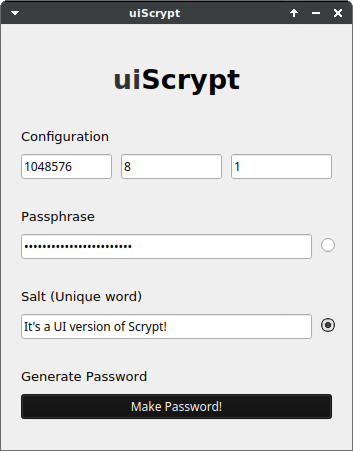

# uiScrypt

It's a UI implementation of [**Scrypt**](https://en.wikipedia.org/wiki/Scrypt) on PyQt5.



You can set default Scrypt configuration via **CMD args**
```
python3 uiScrypt.py 1048576 8 1
```
